<div align="center">



<p>
  <a href="https://withlumen.ai"></a>
  <a href="https://uplyft.ai"></a>
  <a href="https://www.linkedin.com/in/aswinsreenivas"></a>
  <a href="https://x.com/drag88"></a>
</p>

</div>

<br/>

### `> whoami`

```bash
$ cat about.md
```

I build AI agents and the infrastructure to ship them.

By day, I run data for the consumer business at **StarHub** in Singapore. Five teams, four brands, an active migration off legacy infrastructure. By night, I shipped **[Uplyft](https://uplyft.ai)** (AI-native Shopify commerce) and now build **[Lumen](https://withlumen.ai)** (AI visibility intelligence for brands).

Same conviction underneath all of it. The next layer of the internet is agents reading and writing on behalf of humans, and most of the tooling for that layer is still missing. The repos below are my contribution to filling that gap.

<br/>

### `> ls open_source/`

<table>
  <tr>
    <td>
      <a href="https://github.com/drag88/claude-dev-framework">
        
      </a>
    </td>
    <td>
      <a href="https://github.com/drag88/claude-code-agents">
        
      </a>
    </td>
  </tr>
  <tr>
    <td>
      <a href="https://github.com/drag88/claude-memory-system">
        
      </a>
    </td>
    <td>
      <a href="https://github.com/drag88/report-annotator">
        
      </a>
    </td>
  </tr>
</table>

<br/>

### `> tail -f current_work`

**[Lumen](https://withlumen.ai)** is AI visibility intelligence. It probes ChatGPT, Claude, Gemini, and Perplexity at scale, attributes brand presence to revenue, and surfaces concrete fixes. The interesting engineering problems are stable measurement across non-deterministic LLMs, evaluation pipelines that grade themselves, and an attribution model that maps mentions to dollars.

**[Uplyft](https://uplyft.ai)** is AI-native commerce. Semantic search and agent-ready product data for Shopify. The retrieval layer Lumen sits on. Embeddings, reranking, and a structured catalog representation an agent can actually use end-to-end.

<br/>

### `> cat stack.deps`

<p align="center">
  
</p>

<p align="center">
  
  
  
  
  
  
  
</p>

<br/>

### `> git log --stat`

<div align="center">


</div>

<br/>

<picture>
  <source media="(prefers-color-scheme: dark)" srcset="https://raw.githubusercontent.com/drag88/drag88/output/github-snake-dark.svg" />
  <source media="(prefers-color-scheme: light)" srcset="https://raw.githubusercontent.com/drag88/drag88/output/github-snake.svg" />
  
</picture>

<br/><br/>

<div align="center">

<sub><code>$ exit</code> &nbsp;·&nbsp; <code>connection terminated</code> &nbsp;·&nbsp; <code>0xA5W1N</code></sub>

</div>
