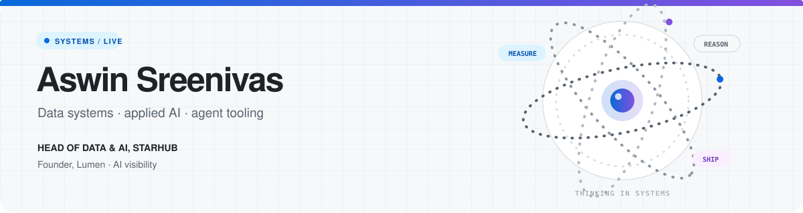

<picture>
  <source media="(prefers-color-scheme: dark)" srcset="./assets/profile-dark.svg">
  <source media="(prefers-color-scheme: light)" srcset="./assets/profile-light.svg">
  
</picture>

## I build data systems and AI products that have to work in the real world.

I lead Consumer Data and AI at StarHub across data engineering, business intelligence, business analytics, and data science. Over the past 12+ years, I have worked across banking, consulting, insurance, and telecom.

I also build [Lumen](https://withlumen.ai/), an AI visibility platform that shows brands how they appear across ChatGPT, Claude, Gemini, and Perplexity. Most of my work lives where data platforms, machine learning systems, and product decisions meet.

I started by modding Android phones. Looking under the hood eventually became a career.

## Current focus

| Mode | What I am working on |
| --- | --- |
| `operate` | Modernising enterprise data platforms and putting analytics and ML into production at StarHub. |
| `build` | Making AI visibility measurable and useful to businesses through [Lumen](https://withlumen.ai/). |
| `open-source` | Building better workflows, memory, and review tools for coding agents. |

## Selected work

| Project | What it does |
| --- | --- |
| [Claude Dev Framework](https://github.com/drag88/claude-dev-framework) | A development framework that gives coding agents a structured engineering loop across Claude Code and Codex. |
| [Report Annotator](https://github.com/drag88/report-annotator) | A dependency-free browser tool for reviewing HTML reports and exporting structured feedback. |
| [Claude Memory System](https://github.com/drag88/claude-memory-system) | A portable, file-based workflow and memory system for coding agents. |

## Working set

`Python` · `SQL` · `Snowflake` · `dbt` · `AWS` · `TypeScript` · `Next.js` · `LLM evaluation` · `agent tooling`

## Writing and links

[LinkedIn](https://www.linkedin.com/in/aswinsreenivas) · [Substack](https://substack.com/@drag88) · [X](https://x.com/drag88) · [Lumen](https://withlumen.ai/)
